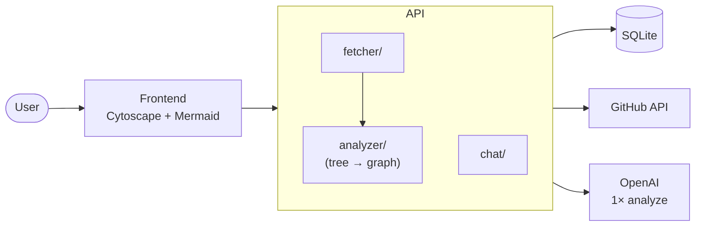
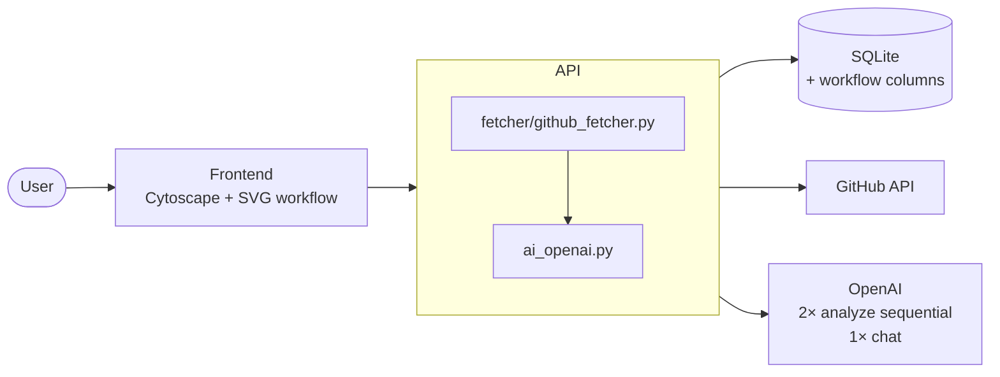
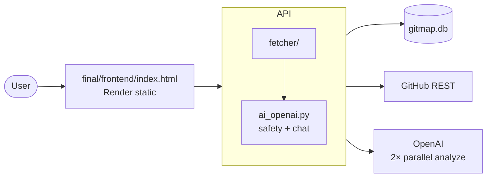

# GitMap — Final Technical Report

**CSEN 174 · Spring 2026**  
**Team:** Sally Kim · Jesse · Daniela Casillas  
**Repository:** [csen-174-s26-team-project-codebase-explainer](https://github.com/CSEN-SCU/csen-174-s26-team-project-codebase-explainer)  
**Code freeze (demo night):** commit [`49bf927`](https://github.com/CSEN-SCU/csen-174-s26-team-project-codebase-explainer/commit/49bf92758315dffbd2d8ca5c412dfaa3c52a6f2f)  
**Live deployment:** [https://csen-174-s26-team-project-codebase-zufu.onrender.com](https://csen-174-s26-team-project-codebase-zufu.onrender.com)  
**Demo video:** linked from [README.md](README.md) (team recording for W9)

> Export this file to PDF for Camino submission. Keep markdown and PDF in sync at code freeze.

---

## 1. Product vision and evolution

### W2 summary (before)

In Week 2 we framed **GitMap** for coders joining a GitHub project with an already-large codebase who struggle to see how parts connect outside their assigned slice. The product would be a **visual mapping assistant** that turns a repo into **interactive graphs**, unlike text-only explainers ([`docs/product-vision.md`](docs/product-vision.md)). Input was loosely described as “upload repo”; interaction included **zooming and filtering** cluttered diagrams.

### Current summary (after)

Today GitMap is for **developers and CS students onboarding to unfamiliar public repos**: paste a URL, receive an **AI-generated architecture graph** (6–14 logical modules), an **animated runtime workflow**, and a **chat panel** grounded in cached analysis ([`product-vision.md`](product-vision.md)). Input is **GitHub URL only** (no upload). We traded generic “filter components” for **two dedicated views**—structure vs. execution flow.

### Before / after at a glance

| Dimension | W2 ([`docs/product-vision.md`](docs/product-vision.md)) | Code freeze ([`product-vision.md`](product-vision.md)) |
|-----------|-----------------------------------------------------------|--------------------------------------------------------|
| Primary user | Coder joining implemented GitHub product | Developer / CS student on any public repo |
| Core output | Interactable nodes / graph images | Cytoscape module graph + SVG workflow + chat |
| Input | Repo upload (ambiguous) | Public GitHub URL |
| Differentiator vs. Claude | Whole-repo structure vs. snippet chat | Spatial, explorable map + workflow, not chat-only |

### Four decisions that bent the vision

1. **URL-only, public GitHub** — Gallery walk and deployment constraints ruled out private repos and file upload; fetcher validates `github.com` host only ([`final/backend/main.py`](final/backend/main.py) `_is_github_url`, [`final/backend/fetcher/github_fetcher.py`](final/backend/fetcher/github_fetcher.py)).
2. **Filters → Architecture + Workflow tabs** — W2 promised filtering; Sprint 2 demos showed users wanted **runtime flow** more than filter UI ([`docs/architecture-retrospective.md`](docs/architecture-retrospective.md) §1, §3).
3. **Dropped Mermaid “Full Map”** — Third tab duplicated Cytoscape and failed on slow loads; replaced with workflow panel ([`docs/architecture-retrospective.md`](docs/architecture-retrospective.md) §1; removed from [`final/frontend/index.html`](final/frontend/index.html)).
4. **Meaningful abstraction over completeness** — Vision said “interactable nodes”; we capped at **AI-chosen modules** (not every file) after 80+ node graphs proved unusable ([`docs/architecture-retrospective.md`](docs/architecture-retrospective.md) §2, [`final/backend/ai_openai.py`](final/backend/ai_openai.py) `_modules_to_graph`).

### Persona / storyboard artifact

W2 narrative in [`docs/product-vision.md`](docs/product-vision.md) centers the **student or new hire assigned a ticket without system context**—still our primary user. The W3 gallery-walk **intro screen** in Daniela’s React prototype ([`prototypes/daniela/frontend/src/components/IntroScreen.jsx`](prototypes/daniela/frontend/src/components/IntroScreen.jsx), [`prototypes/daniela/README.md`](prototypes/daniela/README.md)) storyboarded the same journey: read the problem → paste URL → see graph → ask questions. We **still serve that user**; we dropped Daniela’s **quiz panel** and Gemini stack as out of scope ([`docs/architecture/architecture.md`](docs/architecture/architecture.md) consolidation plan).

**Repo reference:** [`product-vision.md`](product-vision.md) (current Moore’s template), [`docs/product-vision.md`](docs/product-vision.md) (W2 draft).

---

## 2. Architecture evolution (W4 → W8 → code freeze)

Full narrative and debt register: [`docs/architecture-retrospective.md`](docs/architecture-retrospective.md). W4 source diagrams: [`docs/architecture/architecture.md`](docs/architecture/architecture.md).

### W4 — intended architecture (Week 4)

Single-file HTML (**Cytoscape + Mermaid**), FastAPI with **three owner modules** (fetcher / analyzer / chat), **one GPT-4o call per analysis**, graph **structure from real file tree** with AI descriptions only.

**Repo reference:** [`docs/architecture/architecture.md`](docs/architecture/architecture.md) (Level 1–2 diagrams, “file tree drives graph structure”).

### W8 — revised architecture (after consolidation + red team)

After merging Sally’s prototype into `final/` and W7 security remediations: **Mermaid removed**, **two sequential GPT-4o calls** (architecture + workflow), **module-driven graph** in one [`ai_openai.py`](final/backend/ai_openai.py), CORS allowlist ([PR #29](https://github.com/CSEN-SCU/csen-174-s26-team-project-codebase-explainer/pull/29)), prompt-injection + crisis guards ([PR #28](https://github.com/CSEN-SCU/csen-174-s26-team-project-codebase-explainer/pull/28)). Documented at merge [`6340e06`](https://github.com/CSEN-SCU/csen-174-s26-team-project-codebase-explainer/commit/6340e06).

**Repo reference:** [`docs/architecture-retrospective.md`](docs/architecture-retrospective.md) (W8-era container diagram), [`docs/sprint-2-retro.md`](docs/sprint-2-retro.md) (red team response).

### Code freeze — current architecture (Week 10)

Sprint 3 added **parallel GPT-4o calls** (`asyncio.gather`), **pipeline profiling** logs, ethics **disclaimer** in UI, and parallelized per-file GitHub reads ([`e096843`](https://github.com/CSEN-SCU/csen-174-s26-team-project-codebase-explainer/commit/e096843), [`49bf927`](https://github.com/CSEN-SCU/csen-174-s26-team-project-codebase-explainer/commit/49bf927)).

### What changed between stages (triggers + traceability)

| Transition | What changed | Trigger | Repo trace |
|------------|--------------|---------|------------|
| W4 → W8 | File-tree graph → AI module graph | 80+ unreadable nodes on real repos | [`ai_openai.py`](final/backend/ai_openai.py), [`docs/architecture-retrospective.md`](docs/architecture-retrospective.md) §2 |
| W4 → W8 | 1 → 2 analyze prompts + workflow columns | Sprint 2 demo feedback | [`453389d`](https://github.com/CSEN-SCU/csen-174-s26-team-project-codebase-explainer/commit/453389d) UI/UX + workflow persistence |
| W4 → W8 | Wildcard CORS → allowlist | Peer red team finding #1 | [PR #29](https://github.com/CSEN-SCU/csen-174-s26-team-project-codebase-explainer/pull/29), [`unitTesting/test_cors.py`](unitTesting/test_cors.py) |
| W8 → freeze | Sequential → parallel AI calls | Sprint 3 commitment [Issue #34](https://github.com/CSEN-SCU/csen-174-s26-team-project-codebase-explainer/issues/34) | [`e096843`](https://github.com/CSEN-SCU/csen-174-s26-team-project-codebase-explainer/commit/e096843) |
| W8 → freeze | Consolidated `final/` + Render entry | Prototype phase end | [`final/backend/app.py`](final/backend/app.py), [`docs/sprint-1-cicd.md`](docs/sprint-1-cicd.md) |

### Three architectural decision implementations

1. **Module-driven graph** — [`final/backend/ai_openai.py`](final/backend/ai_openai.py) (`analyze_repo`, `_modules_to_graph`).
2. **Cache-first analyze pipeline** — [`final/backend/main.py`](final/backend/main.py) `POST /api/analyze` (lines 109–159).
3. **Untrusted-input boundary for chat** — [`final/backend/ai_openai.py`](final/backend/ai_openai.py) `check_user_message_safety`, hardened `CHAT_SYSTEM` ([PR #28](https://github.com/CSEN-SCU/csen-174-s26-team-project-codebase-explainer/pull/28)).

**Repo reference:** [`docs/architecture-retrospective.md`](docs/architecture-retrospective.md), [`final/backend/main.py`](final/backend/main.py).

---

## 3. Current state of the prototype

### What it does today

| Feature | Behavior | Entry point |
|---------|----------|-------------|
| Repo analysis | Fetch tree + ≤25 files, parallel GPT-4o architecture + workflow, cache in SQLite | [`final/backend/main.py`](final/backend/main.py) `POST /api/analyze` → [`ai_openai.py`](final/backend/ai_openai.py) `analyze_repo` |
| Architecture graph | Cytoscape nodes/edges by module type | [`final/frontend/index.html`](final/frontend/index.html) (graph render after analyze) |
| Workflow view | Animated SVG from `workflow_nodes` / `workflow_edges` | Same frontend file, workflow section |
| Chat | Q&A on cached graph + code context; safety pre-check | [`main.py`](final/backend/main.py) `POST /api/chat` → `chat_about_repo` |
| Recent repos | Landing history | `GET /api/recent` → [`database.py`](final/backend/database.py) |
| Example questions | Template prompts from node types | [`final/example_questions.py`](final/example_questions.py), `GET /api/example-questions` |

**Links:** Live — [Render URL](https://csen-174-s26-team-project-codebase-zufu.onrender.com) · Code freeze — [`49bf927`](https://github.com/CSEN-SCU/csen-174-s26-team-project-codebase-explainer/commit/49bf927) · Demo video — see [README.md](README.md).

### What it does not do yet (seams)

- **No auth or rate limiting** on `/api/analyze` (accepted debt after W7 red team; [`docs/ethics-reflection.md`](docs/ethics-reflection.md) §3).
- **No validation** that AI module paths exist in the fetched tree ([`docs/architecture-retrospective.md`](docs/architecture-retrospective.md) tech debt).
- **Private repos** unsupported (public GitHub only).
- **Frontend untested** — single 900+ line HTML file; all automated tests target backend ([`unitTesting/`](unitTesting/)).
- **README “Full Map / Mermaid”** description is stale vs. code freeze UI (documentation seam).

**Repo reference:** [`final/README.md`](final/README.md), [`README.md`](README.md).

---

## 4. Engineering process: testing, security, deployment

### Testing

| | Planned (W5) | Implemented |
|---|--------------|-------------|
| Scope | Per-owner unit tests + narrow integration on cache seam; RED test for chat contract | [`docs/sprint-1-testing.md`](docs/sprint-1-testing.md) |
| Run | `pytest unitTesting/ -v` on every PR | [`.github/workflows/ci.yml`](.github/workflows/ci.yml) |
| AI in loop | TDD skill generated edge-case tests; team critiqued weak AI tests | [`docs/sprint-1-testing.md`](docs/sprint-1-testing.md) Part 4–5 |

**Methodical example:** `test_analyze_invalid_url_returns_400` in [`unitTesting/test_integration.py`](unitTesting/test_integration.py) — written when the suite returned **502** for `https://notgithub.com/owner/repo` because `github.com` matched inside `notgithub.com`. Fix: negative lookbehind in [`final/backend/fetcher/github_fetcher.py`](final/backend/fetcher/github_fetcher.py) (documented in [`docs/sprint-1-testing.md`](docs/sprint-1-testing.md)). This encodes a **user-visible failure mode**, not an implementation detail.

**What we chose not to test:** Live OpenAI/GitHub in CI (mocked via `unittest.mock`); frontend rendering; end-to-end browser flows. **Why:** determinism and cost; prototype velocity.

**AI vs. human:** AI drafted [`unitTesting/test_example_questions.py`](unitTesting/test_example_questions.py) duplicate-prompt cases; humans rewrote assertions after critique ([`docs/sprint-1-testing.md`](docs/sprint-1-testing.md)). Humans defined the **grounding invariant** for graphs in [`unitTesting/test_ai_behavior.py`](unitTesting/test_ai_behavior.py) (structure keys, non-empty summary)—AI did not set that strategy.

**Repo reference:** [`unitTesting/test_ai_safety.py`](unitTesting/test_ai_safety.py) (post–PR #28), [CI run example](https://github.com/CSEN-SCU/csen-174-s26-team-project-codebase-explainer/actions/runs/25405117888).

### Security

| | Planned (W7 self-audit + peer red team) | Implemented |
|---|----------------------------------------|-------------|
| Scope | Prompt injection, CORS, SSRF, abuse, Responsible AI | [`potential_security_problems.txt`](potential_security_problems.txt), peer findings in [`docs/sprint-2-retro.md`](docs/sprint-2-retro.md) |
| Fixes shipped | Harden prompts + safety layer; CORS allowlist | [PR #28](https://github.com/CSEN-SCU/csen-174-s26-team-project-codebase-explainer/pull/28), [PR #29](https://github.com/CSEN-SCU/csen-174-s26-team-project-codebase-explainer/pull/29), [`docs/sprint-2-remediations.md`](docs/sprint-2-remediations.md) |
| Deferred | Auth, rate limits, path validation vs. tree | [`docs/ethics-reflection.md`](docs/ethics-reflection.md) |

**Finding → fix example:** Peer finding #6 (chat prompt injection) → `check_user_message_safety` blocks override phrases before OpenAI; tests in [`unitTesting/test_ai_safety.py`](unitTesting/test_ai_safety.py). **AI vs. human:** AI helped draft regex-style guards in `ai_openai.py`; team decided **crisis responses must include 988** and that repo-analysis tool must not act as crisis counselor ([`docs/ethics-reflection.md`](docs/ethics-reflection.md)).

**Repo reference:** [`final/backend/ai_openai.py`](final/backend/ai_openai.py) (`check_user_message_safety`), [`final/backend/main.py`](final/backend/main.py) (`get_cors_origins`).

### Deployment

| | Planned (W6) | Implemented |
|---|--------------|-------------|
| Host | Render from `main` branch | [`docs/sprint-1-cicd.md`](docs/sprint-1-cicd.md) |
| Pipeline | PR + push to `main` → pytest | [`.github/workflows/ci.yml`](.github/workflows/ci.yml) jobs: checkout, Python 3.12, install `unitTesting/requirements-test.txt`, `pytest unitTesting/ -v` |
| Secrets | `OPENAI_API_KEY`, `GITHUB_TOKEN` in GitHub Actions + Render env | [`docs/sprint-1-cicd.md`](docs/sprint-1-cicd.md) |

**AI vs. human:** Claude/Cursor fixed **wrong `requirements.txt`** (Flask/gunicorn leftovers) and **`127.0.0.1` hardcoded API URL** blocking production ([`docs/sprint-1-retro.md`](docs/sprint-1-retro.md)); humans verified Render dashboard env vars and chose `uvicorn app:app` entry ([`final/backend/app.py`](final/backend/app.py)).

**Repo reference:** [`.github/workflows/ci.yml`](.github/workflows/ci.yml), [`final/backend/app.py`](final/backend/app.py).

---

## 5. Successes, setbacks, and AI across the quarter

Sources: [`docs/sprint-1-retro.md`](docs/sprint-1-retro.md), [`docs/sprint-2-retro.md`](docs/sprint-2-retro.md), Sprint 3 work in git history.

### Successes (practices to keep)

1. **RED-first chat contract (Sprint 1)** — `test_answer_uses_cached_context` specified chat behavior before implementation; forced explicit Sprint 2 delivery ([`docs/sprint-1-testing.md`](docs/sprint-1-testing.md), [`unitTesting/test_chat.py`](unitTesting/test_chat.py)).
2. **Peer red team → shipped PRs (Sprint 2)** — Daniela landed [PR #28](https://github.com/CSEN-SCU/csen-174-s26-team-project-codebase-explainer/pull/28) and [PR #29](https://github.com/CSEN-SCU/csen-174-s26-team-project-codebase-explainer/pull/29) before W8 deadline ([`docs/sprint-2-retro.md`](docs/sprint-2-retro.md)).
3. **Sprint 3 scope discipline** — One commitment (pipeline latency, [Issue #34](https://github.com/CSEN-SCU/csen-174-s26-team-project-codebase-explainer/issues/34)) → parallel AI + profiling in [`e096843`](https://github.com/CSEN-SCU/csen-174-s26-team-project-codebase-explainer/commit/e096843) instead of unfinished feature sprawl.

### Setbacks (signals missed, lessons)

1. **Merge conflicts on `main` (Sprint 1)** — Multiple teammates pushed to `main` simultaneously; AI resolved syntax but not **whose logic was correct** ([`docs/sprint-1-retro.md`](docs/sprint-1-retro.md)). *Missed signal:* overlapping edits in `app.py` / `test_chat.py`. *Would do:* feature branches + PR-only merges earlier ([Issue #25](https://github.com/CSEN-SCU/csen-174-s26-team-project-codebase-explainer/issues/25)).
2. **Workflow data silently dropped (Sprint 2)** — Cached analyses returned empty workflow until SQLite write path fixed in [`453389d`](https://github.com/CSEN-SCU/csen-174-s26-team-project-codebase-explainer/commit/453389d). *Missed signal:* no integration test asserting `workflow_nodes` round-trip. *Would do:* extend [`test_integration.py`](unitTesting/test_integration.py) when schema grows.
3. **Vision/architecture drift (W4 → product)** — W4 promised tree-grounded graphs; we **inverted** to AI modules after user testing ([`docs/architecture/architecture.md`](docs/architecture/architecture.md) vs. [`docs/architecture-retrospective.md`](docs/architecture-retrospective.md) §2). *Missed signal:* early graphs with 80+ nodes. *Would do:* validate with one large OSS repo in Week 5, not Week 8.

### AI tools — specific moments

- **Deployment:** AI corrected dependencies and production API base URL ([`docs/sprint-1-retro.md`](docs/sprint-1-retro.md)) — high leverage.
- **Merge conflicts:** AI could not choose between teammates’ implementations — we re-ran locally.
- **Testing:** TDD skill generated tests we **partially rejected** after human critique ([`docs/sprint-1-testing.md`](docs/sprint-1-testing.md)).
- **Architecture:** We **unwound** file-tree-as-graph after seeing AI-only module graphs worked better — human judgment over initial AI-friendly W4 design.

**Repo reference:** [`docs/sprint-1-retro.md`](docs/sprint-1-retro.md), [`docs/sprint-2-retro.md`](docs/sprint-2-retro.md).

---

## 6. Future work

| Priority | Item | Why | Effort |
|----------|------|-----|--------|
| 1 | Auth + rate limiting on `/api/analyze` | Stops API budget abuse ([`docs/ethics-reflection.md`](docs/ethics-reflection.md)) | **Sprint** |
| 2 | Validate AI module paths against fetched `file_tree` | Reduces hallucination harm; ethics disclaimer is not enough | **Week** |
| 3 | Async analyze jobs (submit → poll) | Removes 10–20s blocking HTTP ([`docs/architecture/architecture.md`](docs/architecture/architecture.md) scale note) | **Sprint** |
| 4 | Frontend component split + smoke tests | 900-line HTML is brittle ([`docs/architecture-retrospective.md`](docs/architecture-retrospective.md)) | **Sprint** |
| 5 | **Research:** reliable graph grounding without per-file nodes | May need hybrid static analysis + LLM | **Research problem** (not one sprint) |

**Repo reference:** [Issue #34](https://github.com/CSEN-SCU/csen-174-s26-team-project-codebase-explainer/issues/34) (latency — partially done), open issues on team board.

---

## 7. Advice to future CSEN 174 teams

1. **Write the failing integration test the moment you add a SQLite column** — we lost workflow data in cache until Sprint 2 because the cache seam test did not assert new fields (see §5 setback 2).
2. **Branch and PR before you “just push to main” for a week** — merge conflicts cost more than review overhead (see [`docs/sprint-1-retro.md`](docs/sprint-1-retro.md)).
3. **Run one large real repo through your analyzer in Week 5** — it would have exposed the 80-node graph failure before architecture docs were frozen (see [`docs/architecture-retrospective.md`](docs/architecture-retrospective.md) §2).

---

## Appendix — artifact index

| Artifact | Path |
|----------|------|
| W2 product vision | [`docs/product-vision.md`](docs/product-vision.md) |
| Current product vision | [`product-vision.md`](product-vision.md) |
| W4 / W8 architecture | [`docs/architecture/architecture.md`](docs/architecture/architecture.md), [`docs/architecture-retrospective.md`](docs/architecture-retrospective.md) |
| W5 testing plan | [`docs/sprint-1-testing.md`](docs/sprint-1-testing.md) |
| W6 CI/CD | [`docs/sprint-1-cicd.md`](docs/sprint-1-cicd.md), [`.github/workflows/ci.yml`](.github/workflows/ci.yml) |
| W7 security / remediations | [`potential_security_problems.txt`](potential_security_problems.txt), [`docs/sprint-2-remediations.md`](docs/sprint-2-remediations.md) |
| W9 ethics | [`docs/ethics-reflection.md`](docs/ethics-reflection.md) |
| Sprint retros | [`docs/sprint-1-retro.md`](docs/sprint-1-retro.md), [`docs/sprint-2-retro.md`](docs/sprint-2-retro.md) |
| Kanban / issues | [GitHub Issues](https://github.com/CSEN-SCU/csen-174-s26-team-project-codebase-explainer/issues) |
