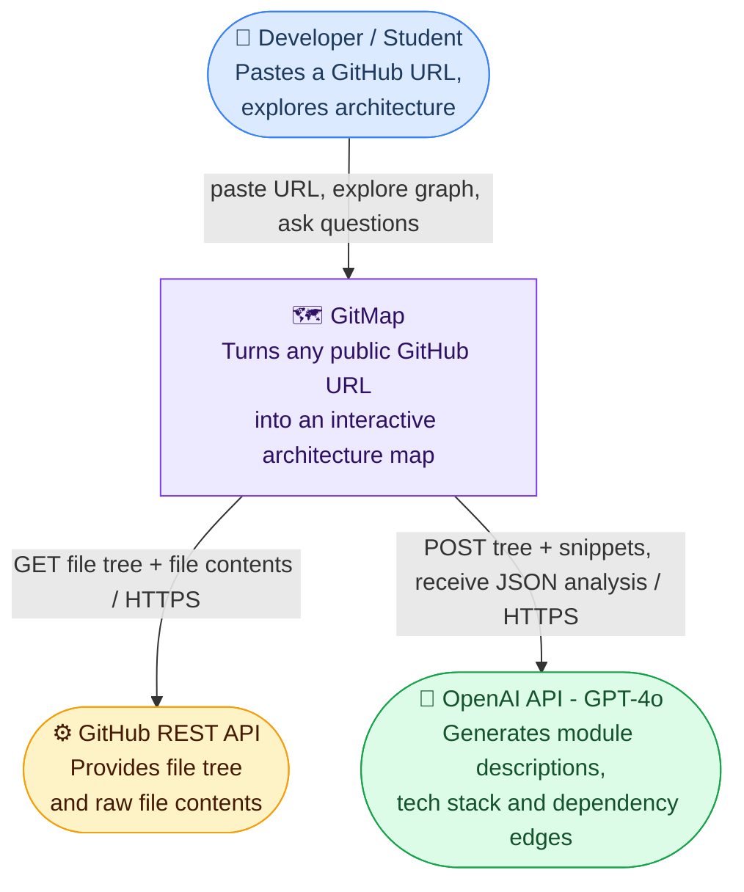
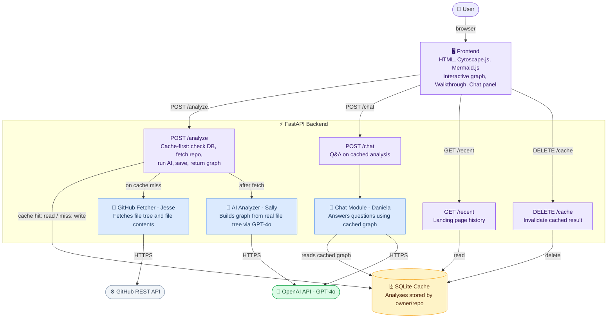

# GitMap — Architecture Documentation

## Consolidation Plan

The team is building on **Sally's prototype** as the foundation. The core pipeline — GitHub URL → file tree → AI analysis → interactive graph — is already working end-to-end. We are adding Daniela's chat panel concept (ask questions about the repo after analysis) and keeping Jesse's simpler scoping (focus on explaining structure, not raw code).

**What we're keeping from each prototype:**
- Sally: FastAPI backend, OpenAI GPT-4o, SQLite caching, Cytoscape.js graph, progressive disclosure tree, walkthrough view
- Daniela: chat panel UX pattern (ask the architecture questions after analysis)
- Jesse: nothing technical, but the principle of keeping AI explanations plain and short

**What we're leaving behind:**
- Daniela's React/Vite frontend (adds build complexity for no gain at this stage), Gemini API, quiz panel
- Jesse's C++ backend, raw code paste input, no-graph approach

**Tech stack:**
- Frontend: Single-file HTML + Cytoscape.js + Mermaid.js (no build step, opens in browser directly)
- Backend: Python + FastAPI + uvicorn
- Database: SQLite (zero-config, single file, sufficient for prototype scale)
- AI: OpenAI GPT-4o via the OpenAI Python SDK
- GitHub data: GitHub REST API via httpx

**Ownership:**
- Sally — AI analyzer, graph engine, frontend views (interactive + walkthrough)
- Daniela — chat integration (POST /chat endpoint + chat UI panel)
- Jesse — GitHub fetcher, SQLite cache layer

---

## Level 1 — System Context

GitMap sits between one type of user and two external systems. A developer or student who needs to understand an unfamiliar codebase pastes a GitHub URL and receives an interactive architecture map within seconds — no cloning, no reading, no guessing. GitMap calls GitHub to get the raw repository contents and OpenAI to interpret them. Nothing else crosses the system boundary.

---

## Level 2 — Component Diagram (FastAPI API)

The FastAPI backend is the orchestration layer. It exposes four endpoints, each owned by a distinct Python module. The `/analyze` route is the most complex — it is the only one that calls external services, and only when the SQLite cache has no stored result for the requested repo. All other routes are thin wrappers that read from or write to the local cache with no external calls.

---

## Key Design Decisions

**Why does the file tree drive graph structure, not the AI?**
Early versions let GPT-4o decide which nodes to create. It hallucinated directories that didn't exist and missed real ones. The fix: graph structure is built algorithmically from the real GitHub file tree. AI only fills in descriptions and suggests dependency edges. The graph is always grounded in reality.

**Why SQLite instead of Postgres?**
SQLite has zero setup — no separate server process, no connection string, no migrations tool. It lives in a single file and handles our read-heavy workload (most requests are cache hits) without connection pooling. If the product scaled to many concurrent users we'd add a job queue and switch to Postgres, but that's premature at prototype stage.

**Why a single HTML file for the frontend instead of React?**
A single HTML file means anyone on the team (or a gallery walk visitor) can open it directly in a browser with no npm install, no build step, no tooling. The tradeoff is harder component reuse — acceptable for a prototype. The standalone `demo.html` takes this further and needs no backend at all, making it useful for offline demos.

**Why separate modules for fetcher, analyzer, and chat?**
Each module has a distinct external dependency (GitHub API, OpenAI for analysis, OpenAI for chat) and a distinct owner. Keeping them in separate directories means teammates can develop and test independently with no merge conflicts. `main.py` only imports and wires them together — it has no business logic of its own.

**What would break at scale?**
The main bottleneck is holding an HTTP connection open while GitMap calls two external APIs sequentially. For large repos this can take 10–15 seconds. At scale we'd make analysis async: the frontend submits a job, the backend returns a job ID immediately, and the frontend polls for the result. We'd also add a job queue (Celery + Redis) so multiple analyses can run in parallel without blocking each other.
