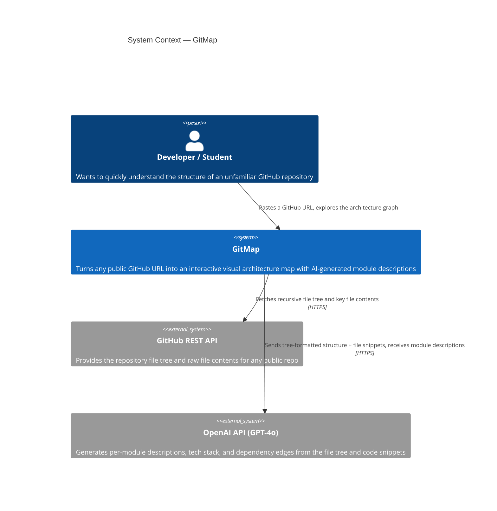
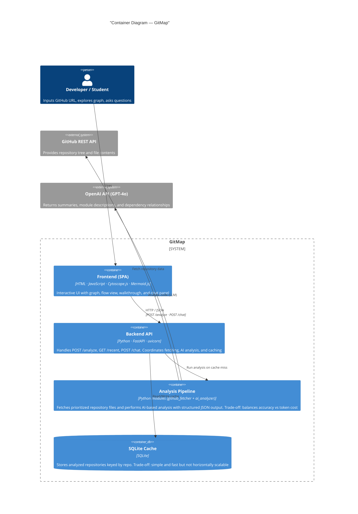

# GitMap — Architecture Documentation

## Consolidation Plan

The team is building on **Sally's prototype** as the foundation. The core pipeline — GitHub URL → file tree → AI analysis → interactive graph — is already working end-to-end. We are adding Daniela's chat panel concept (ask questions about the repo after analysis) and keeping Jesse's simpler scoping (focus on explaining structure, not raw code).

**What we're keeping from each prototype:**
- Sally: FastAPI backend, OpenAI GPT-4o, SQLite caching, Cytoscape.js graph, progressive disclosure tree, walkthrough view
- Daniela: chat panel UX pattern (ask the architecture questions after analysis)
- Jesse: nothing technical, but the principle of keeping AI explanations plain and short

**What we're leaving behind:**
- Daniela's React/Vite frontend (adds build complexity for no gain at this stage), Gemini API, quiz panel
- Jesse's C++ backend, raw code paste input, no-graph approach

**Tech stack:**
- Frontend: Single-file HTML + Cytoscape.js + Mermaid.js (no build step, opens in browser directly)
- Backend: Python + FastAPI + uvicorn
- Database: SQLite (zero-config, single file, sufficient for prototype scale)
- AI: OpenAI GPT-4o via the OpenAI Python SDK
- GitHub data: GitHub REST API via httpx

**Ownership:**
- Sally — AI analyzer, graph engine, frontend views (interactive + walkthrough)
- Daniela — chat integration (POST /chat endpoint + chat UI panel)
- Jesse — GitHub fetcher, SQLite cache layer

---

## Context Diagram

The context diagram shows GitMap as a single system surrounded by the one type of user and two external systems it depends on. A developer or student pastes a GitHub URL into GitMap. GitMap talks to GitHub to get the code and to OpenAI to understand it — those are the only two external dependencies.

---

## Container Diagram

The container diagram zooms into GitMap and shows five containers. The **Frontend** is a single HTML file served by the backend — no separate build step. The **FastAPI Backend** orchestrates everything: it checks the SQLite cache first, calls the GitHub Fetcher if needed, then passes the result to the AI Analyzer. The **GitHub Fetcher** and **AI Analyzer** are separate Python modules with distinct external dependencies (GitHub vs OpenAI), kept separate so each teammate owns one cleanly. The **SQLite Cache** stores every completed analysis so repeat lookups never re-call GitHub or OpenAI.

Data flows in one direction: user → frontend → backend → (cache hit? return immediately) → fetcher → analyzer → cache → response.

---

## Key Design Decisions

**Why does the file tree drive graph structure, not the AI?**
Early versions let GPT-4o decide which nodes to create. It hallucinated directories that didn't exist and missed real ones. The fix: graph structure is built algorithmically from the real GitHub file tree. AI only fills in descriptions and suggests dependency edges. The graph is always grounded in reality.

**Why SQLite instead of Postgres?**
SQLite has zero setup — no separate server process, no connection string, no migrations tool. It lives in a single file and handles our read-heavy workload (most requests are cache hits) without connection pooling. If the product scaled to many concurrent users we'd add a job queue and switch to Postgres, but that's premature at prototype stage.

**Why a single HTML file for the frontend instead of React?**
A single HTML file means anyone on the team (or a gallery walk visitor) can open it directly in a browser with no npm install, no build step, no tooling. The tradeoff is harder component reuse — acceptable for a prototype. The standalone `demo.html` takes this further and needs no backend at all, making it useful for offline demos.

**What would break at scale?**
The main bottleneck is holding an HTTP connection open while GitMap calls two external APIs sequentially. For large repos this can take 10–15 seconds. At scale we'd make analysis async: the frontend submits a job, the backend returns a job ID immediately, and the frontend polls for the result. We'd also add a job queue (Celery + Redis) so multiple analyses can run in parallel.
