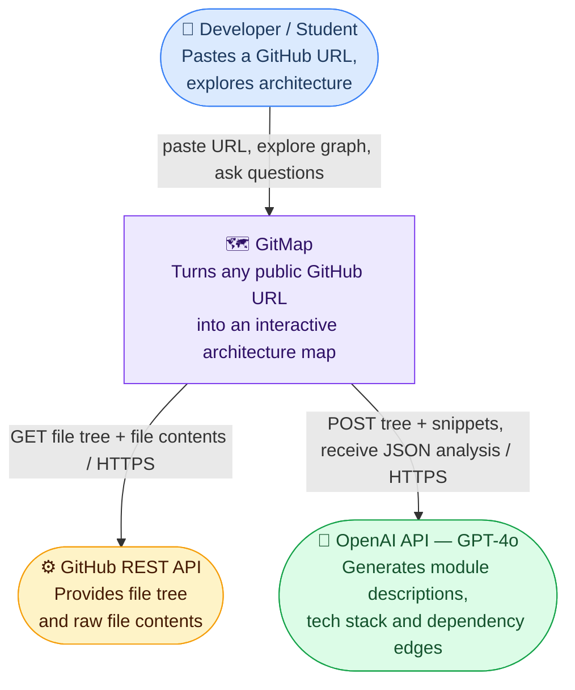
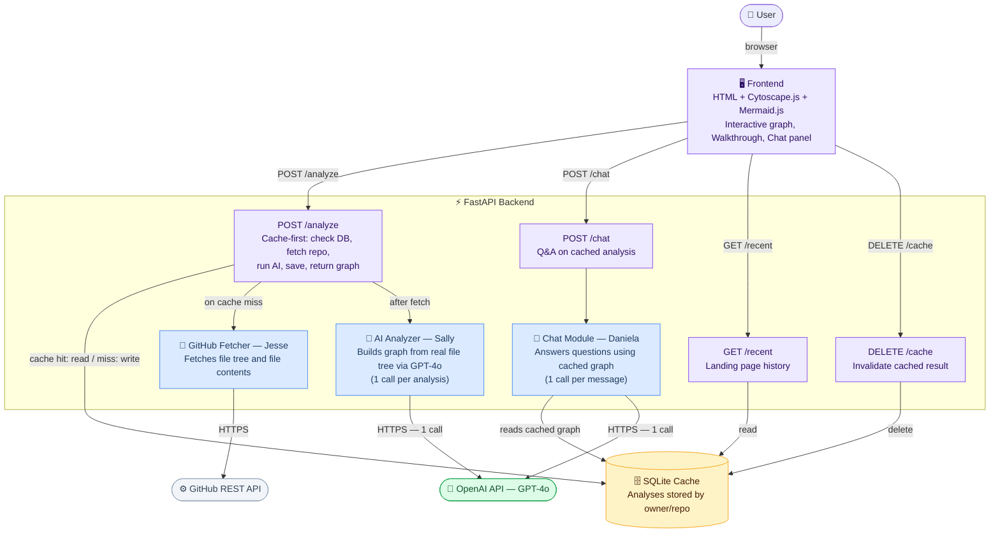
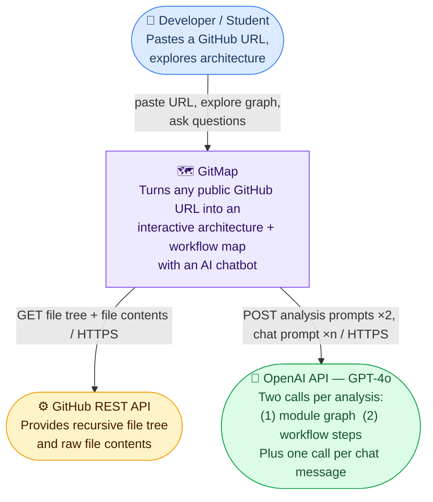
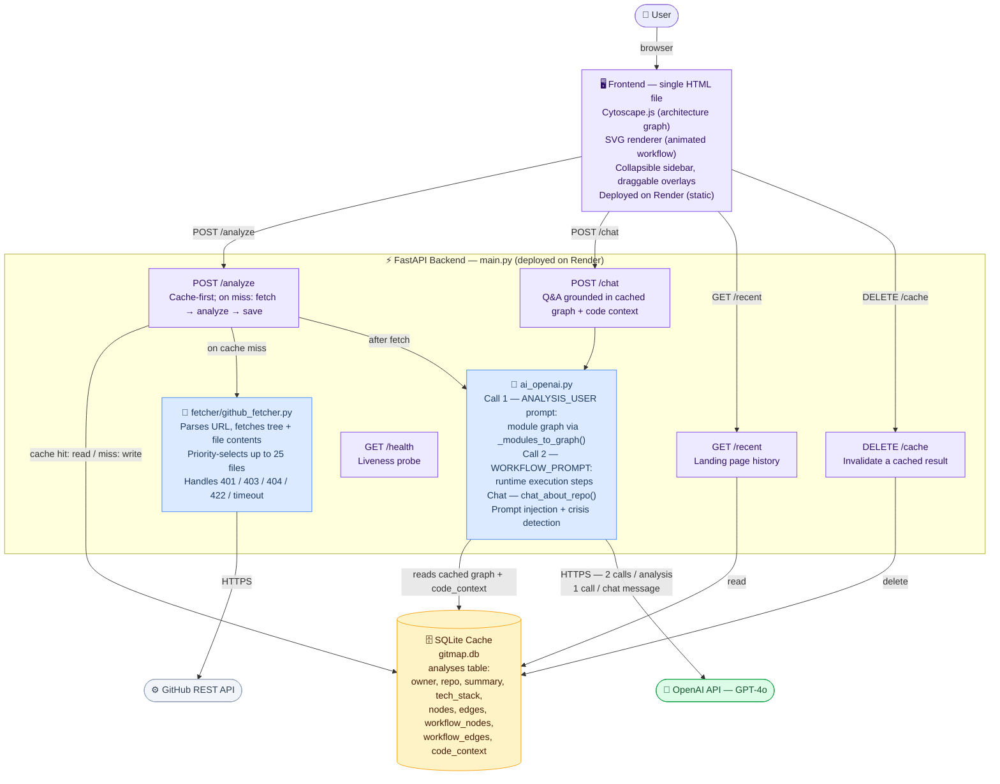

# Architecture Retrospective — GitMap

## Product Vision (Revisited)

The W2 product vision statement, reproduced below, remains accurate in its core framing. The audience (developers and CS students onboarding to unfamiliar repositories), the problem (architecture comprehension without reading thousands of lines of code), and the key differentiator (interactive, on-demand graph generation from a pasted URL) are unchanged.

> **FOR** developers — including CS students and professional engineers — who have just joined a GitHub project that already has a large, implemented codebase, **WHO** struggle to understand the overall structure, component relationships, and architecture of an unfamiliar repository, **THE** GitMap is a visual mapping assistant web application for GitHub **THAT** automatically analyzes a repository and generates an interactive, explorable graph of its architecture — showing modules, services, dependencies, and how they connect — so developers can get oriented quickly without reading thousands of lines of code. **UNLIKE** text-based tools (documentation, inline comments, AI chat assistants like Claude or ChatGPT) that explain individual code snippets, or static diagram generators that produce overwhelming, non-interactive output, **OUR PRODUCT** explains codebase structure as a dynamic, interactive graph that users can explore — zooming into relevant modules, clicking nodes for plain-English explanations — making architecture understanding intuitive rather than overwhelming. **POWERED BY** OpenAI API (GPT-4o) for AI-driven codebase analysis, and web-based graph visualization libraries for interactive rendering.

Two things shifted since W2. First, the vision mentioned "filtering components" as a planned interaction; this was deprioritized in favor of two distinct views — an architecture module graph and an animated runtime workflow — which turned out to be a more natural separation than filter controls. Second, Mermaid.js was originally listed as a visualization technology alongside Cytoscape.js; it was removed entirely by code freeze (see Decisions That Shifted, §1).

---

## W4 Intended Architecture

The full W4 diagrams are also available in [`docs/architecture/architecture.md`](architecture/architecture.md). In summary: a single-file HTML frontend (Cytoscape.js + Mermaid.js, no build step) would call a Python FastAPI backend exposing four endpoints — `/analyze`, `/chat`, `/recent`, and `/cache`. On a cache miss, `/analyze` would invoke Jesse's GitHub fetcher, then Sally's AI analyzer, which would build the architecture graph **algorithmically from the real directory tree** with AI-generated descriptions. Daniela's chat module would answer follow-up questions. All results stored in SQLite. One GPT-4o call per analysis, one per chat message.

### W4 — Level 1 Context Diagram

### W4 — Level 2 Container Diagram

---

## Current-State Architecture

### Level 1 — System Context

The system boundary is identical to W4. GitMap still sits between one user type and two external systems, with no additional integrations added.

### Level 2 — Container Diagram

The container topology is similar to W4, with three meaningful structural changes: Mermaid.js is gone from the frontend, the AI layer now makes two sequential GPT-4o calls per analysis, and the chat and analysis logic are consolidated into a single `ai_openai.py` module rather than maintained as separate files per teammate.

---

## Decisions That Shifted

### 1. Mermaid.js "Full Map View" removed

**Context.** The W4 plan included a third tab — a "Full Map View" powered by Mermaid.js — that would render a text-based dependency diagram alongside the Cytoscape interactive graph. In practice, once the Cytoscape graph was working well the Mermaid tab added a third visual that contained identical information in a less interactive form. Red team feedback confirmed that demo visitors ignored it. The dependency also created a loading risk: Mermaid is a large bundle and occasionally failed to render on slow connections.

**Decision.** The team dropped Mermaid.js entirely from the frontend and replaced the "Full Map View" tab with a new right-hand panel showing an animated SVG workflow diagram (the runtime execution steps from the second GPT-4o call). The "Full Map View" feature label was also removed from the landing page.

**Consequences.** The frontend lost one external JavaScript dependency and one bundle-load failure mode. The tradeoff is that there is no text-based, copy-pasteable representation of the dependency graph — useful for embedding in docs — but that use case was never validated with real users.

**Classification.** Deliberate-Prudent. The team understood the tradeoff explicitly (dropping a planned feature) and made the call based on user feedback and sprint capacity. The result is a tighter product with no inadvertent complexity left behind.

---

### 2. File-tree-driven graph structure replaced by AI-module-driven graph

**Context.** The W4 architecture document states: "graph structure is built algorithmically from the real GitHub file tree. AI only fills in descriptions and suggests dependency edges." In the first working prototype every file in the tree became a node, which produced graphs with 80-100 nodes for any reasonably sized repo. These were unreadable. Attempts to filter programmatically by extension or depth heuristic produced better-looking but still arbitrary graphs.

**Decision.** The analyzer was rewritten so that GPT-4o itself identifies which paths are architecturally meaningful modules (reading actual file contents, not just the tree listing). `_modules_to_graph()` in `ai_openai.py` builds the node and edge set exclusively from the AI-identified modules, using fuzzy path matching to resolve `depends_on` references. The real file tree is still fetched and passed to GPT-4o as context, but it no longer drives graph structure.

**Consequences.** Graph quality improved substantially — typical repos now produce 6-14 well-labeled nodes instead of 80 noisy ones. The new risk is that a poor GPT-4o response (wrong paths, hallucinated modules, empty `modules` list) produces a degraded or empty graph with no fallback. There is no validation layer that checks AI-returned paths against the actual file tree before rendering. This is deferred debt.

**Classification.** Deliberate-Prudent. The shift was made consciously after observing the failure mode of the algorithmic approach. The team accepted a new AI-dependency risk in exchange for a dramatically better user-facing result.

---

### 3. Single GPT-4o call per analysis expanded to two sequential calls

**Context.** Sprint 2 demos showed that users wanted to understand not just which modules exist but how data flows through the system at runtime — the sequence of steps from "user pastes URL" to "graph renders." A single prompt could not reliably produce both a well-structured module graph (with accurate `depends_on` edges) and a coherent runtime execution sequence in one JSON response. Attempts to merge both into one prompt degraded quality on both dimensions.

**Decision.** Analysis was split into two sequential GPT-4o calls: the `ANALYSIS_USER` prompt produces the architecture module graph, and the `WORKFLOW_PROMPT` produces `workflow_nodes` and `workflow_edges` as an ordered execution sequence. Both results are stored together in SQLite. The SQLite schema required a migration to add `workflow_nodes` and `workflow_edges` columns, handled automatically by `init_db()` on startup.

**Consequences.** Fresh analysis now makes two GPT-4o API calls instead of one, doubling the per-analysis cost and adding 5-10 seconds of wall-clock time (the calls run sequentially, not in parallel). The SQLite schema migration is handled with simple `ALTER TABLE` checks rather than a proper migration tool, which means schema drift is possible if the table definition changes again. Cached results from before this change return empty workflow data and prompt the user to re-analyze.

**Classification.** Deliberate-Prudent. The cost and latency tradeoff was understood before shipping. Parallelizing the two calls with `asyncio.gather` would cut latency in half and is a clean, bounded improvement, but was deferred to keep the PR small.

---

## Tech Debt Heading into Code Freeze

**Sequential AI calls (no parallelism).** The two GPT-4o calls in `analyze_repo()` run one after the other. They are independent and could be parallelized with `asyncio.gather`, cutting fresh analysis time by 40-50%. *Quadrant: Deliberate-Prudent — the team chose sequential calls for simplicity; we will live with this through demo night.*

**No retry logic on OpenAI or GitHub calls.** A transient network error or a momentary OpenAI overload returns a 500 directly to the user with no retry attempt. Simple exponential backoff with two retries would cover the majority of transient failures. *Quadrant: Inadvertent-Reckless — the team did not plan for it and it has not been prioritized. Will live with it through demo night.*

**No authentication or rate limiting on `/api/analyze`.** Any visitor can trigger a full GPT-4o analysis (two API calls) for any public repo. The SQLite cache mitigates repeat cost, but a novel URL on every request would drain API budget with no guard. *Quadrant: Inadvertent-Reckless — discovered during red team, not addressed because an auth system is out of scope. Will live with it.*

**SQLite under concurrent writes.** SQLite serializes writes, so two simultaneous re-analyses of different repos will queue behind each other. Under demo load (one user at a time) this is invisible. Under real concurrent load it would cause lock timeouts. *Quadrant: Deliberate-Prudent — zero-config SQLite was the right call for prototype scale; a Postgres migration would be the next step at production scale.*

**Single 900-line HTML frontend.** The frontend grew organically from a quick prototype and has no component boundaries, no tests, and no way to reuse UI patterns across pages. *Quadrant: Inadvertent-Prudent — the team now knows the right structure (a component framework with a build step) but a no-build-step HTML file was the correct velocity tradeoff for this sprint. Will live with it.*

**No validation of AI-returned paths against the real file tree.** `_modules_to_graph()` trusts GPT-4o's `path` values without checking that they exist in the fetched file tree. A hallucinated path creates a valid-looking node that points nowhere. *Quadrant: Inadvertent-Prudent — identified during code review; a one-pass filter against `file_tree` would fix it but was not prioritized before code freeze.*

---

## What the Team Would Do Differently

With another sprint, the team would instrument and profile the full analysis pipeline — from GitHub fetch through the two sequential GPT-4o calls — to pinpoint where latency accumulates and address the biggest bottlenecks before they become a friction point for real users.
