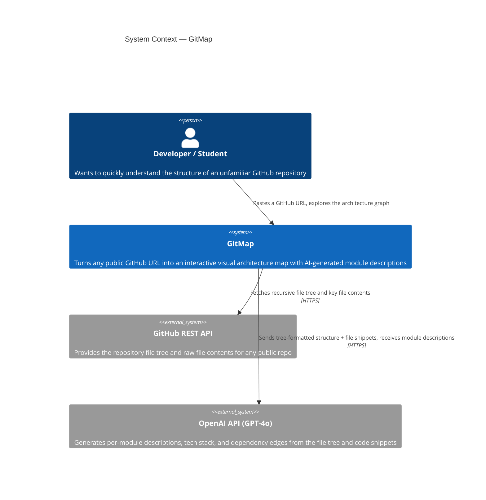
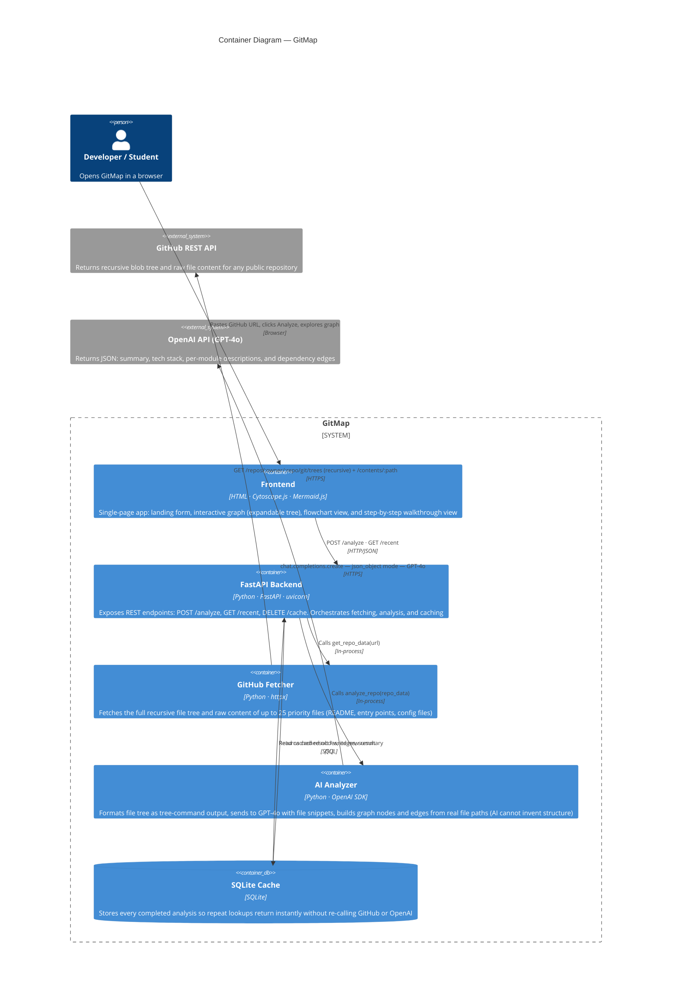

# GitMap — C4 Architecture Diagrams

## Context Diagram

> **What does our system talk to?**
> GitMap sits between a developer and the complexity of an unfamiliar codebase. It talks to two external systems: GitHub (to get the code) and OpenAI (to understand it).

---

## Container Diagram

> **What are the big pieces, and how do they connect?**
> The frontend is a single HTML file served directly by the backend. The backend has three clear responsibilities: fetch (GitHub), analyze (AI), and cache (SQLite). The AI analyzer is the only component that talks to OpenAI — everything else is isolated.

---

## Key design decisions

**Why does the file tree drive graph structure, not the AI?**
Early versions let GPT-4o invent the graph. It hallucinated nodes that didn't exist and missed real directories. Now the graph structure comes entirely from the real GitHub file tree — AI only adds descriptions and dependency edges. This makes the output verifiable and reproducible.

**Why SQLite instead of Postgres?**
GitMap is a prototype used by a small team for demos. SQLite has zero setup cost, stores everything in a single file, and handles our read-heavy workload (most analyses are cache hits) without connection pooling. If this scaled to many concurrent users we'd switch to Postgres.

**Why a single HTML file for the frontend instead of React?**
React would add a build step (npm, Vite, bundler) that every teammate needs to run locally. A single HTML file means anyone can open it directly in a browser — including the standalone `demo.html` which needs no backend at all. The tradeoff is that component reuse is harder, but for a prototype with one main view this is acceptable.

**What would break at scale?**
The biggest bottleneck is the sequential dependency on two external APIs (GitHub then OpenAI). For large repos, GitHub's tree API can be slow and OpenAI has rate limits. At scale we'd add a job queue (e.g. Celery + Redis) so analysis runs async and the frontend polls for results, rather than holding the HTTP connection open.
